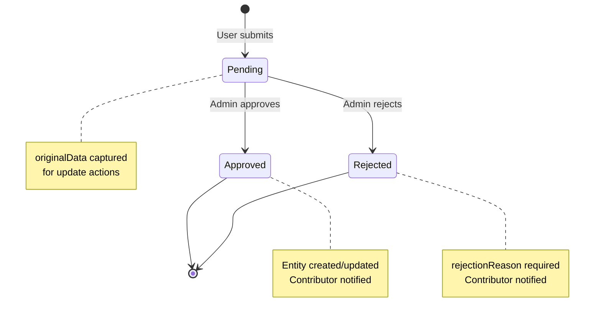
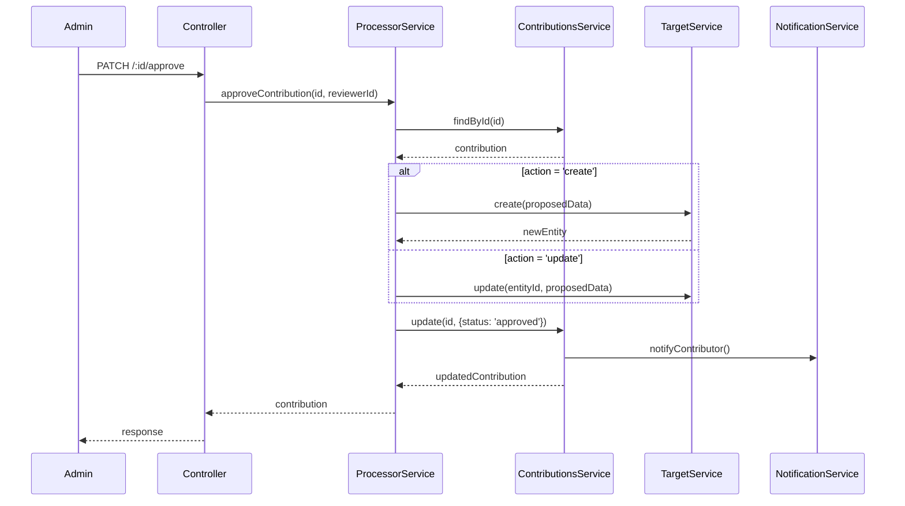
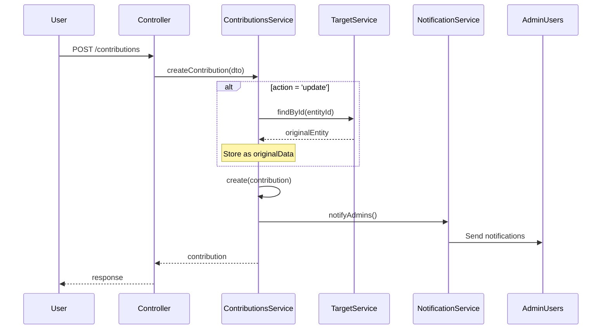
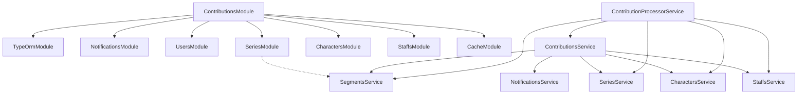

# Contributions Module Documentation

> **Purpose**: AI-readable context for the Contributions module - a user contribution system enabling create/update requests for domain entities with admin approval workflow.

---

## 1. Module Overview

### What It Does

The Contributions module implements a **content moderation workflow** where users can submit requests to create or update entities (Series, Segment, Character, Staff). These contributions require admin review before changes are applied to the database.

### Core Workflow

```
User submits contribution → Status: PENDING → Admin reviews → APPROVED (apply changes) / REJECTED (with reason)
```

### Supported Entity Types

| Entity Type | Constant Key | Target Service |
|-------------|--------------|----------------|
| `series` | `ENTITY_TYPE.SERIES` | `SeriesService` |
| `segment` | `ENTITY_TYPE.SEGMENT` | `SegmentsService` |
| `character` | `ENTITY_TYPE.CHARACTER` | `CharactersService` |
| `staff` | `ENTITY_TYPE.STAFF` | `StaffsService` |

### Supported Actions

| Action | Constant Key | Description |
|--------|--------------|-------------|
| `create` | `ACTION.CREATE` | Submit data to create a new entity |
| `update` | `ACTION.UPDATE` | Submit changes to an existing entity (requires `entityId`) |

### Status Lifecycle

| Status | Constant Key | Description |
|--------|--------------|-------------|
| `pending` | `STATUS.PENDING` | Awaiting admin review (default) |
| `approved` | `STATUS.APPROVED` | Admin approved, changes applied |
| `rejected` | `STATUS.REJECTED` | Admin rejected with reason |

---

## 2. Entity Schema

### Contribution Entity

**Table**: `contributions`  
**Location**: `src/contributions/entities/contribution.entity.ts`  
**Base Class**: `BaseEntityCustom` (provides `id`, `uuid`, `createdAt`, `updatedAt`, `deletedAt`, `version`)

#### Fields

| Field | Type | Nullable | Description |
|-------|------|----------|-------------|
| `entityType` | `varchar(50)` | No | Type of entity: `series`, `segment`, `character`, `staff` |
| `entityId` | `bigint` | Yes | Target entity ID (null for `create` action) |
| `action` | `varchar(20)` | No | Action type: `create` or `update` |
| `proposedData` | `jsonb` | No | Complete data structure to apply if approved |
| `originalData` | `jsonb` | Yes | Snapshot of original entity (only for `update` action) |
| `status` | `varchar(20)` | No | Status: `pending`, `approved`, `rejected` (default: `pending`) |
| `contributorId` | `bigint` | No | User ID who submitted the contribution |
| `reviewerId` | `bigint` | Yes | Admin ID who reviewed (null until reviewed) |
| `rejectionReason` | `text` | Yes | Reason for rejection (if rejected) |
| `adminNotes` | `text` | Yes | Internal notes from admin |
| `contributorNote` | `text` | Yes | Optional explanation from contributor |
| `reviewedAt` | `timestamptz` | Yes | Timestamp of review decision |

#### Relationships

```typescript
contributor: User  // ManyToOne, required - User who submitted
reviewer: User     // ManyToOne, optional - Admin who reviewed
```

#### Database Indexes

| Index | Columns | Purpose |
|-------|---------|---------|
| Composite | `[entityType, status]` | Filter by entity type and status |
| Composite | `[contributorId, status]` | User's contributions by status |
| Composite | `[status, createdAt]` | Pending contributions sorted by date |
| Single | `entityType` | Filter by entity type |
| Single | `entityId` | Filter by target entity |
| Single | `status` | Filter by status |
| Single | `contributorId` | Filter by contributor |

---

## 3. Service Architecture

### ContributionsService

**Location**: `src/contributions/contributions.service.ts`  
**Base Class**: `BaseService<Contribution>`

#### Configuration

```typescript
{
  entityName: 'Contribution',
  cache: {
    enabled: true,
    ttlSec: 60,
    prefix: 'contributions',
    swrSec: 30
  },
  defaultSearchField: 'entityType',
  relationsWhitelist: { contributor: true, reviewer: true },
  selectWhitelist: {
    id, entityType, entityId, action, proposedData, originalData,
    status, contributorId, reviewerId, rejectionReason, adminNotes,
    contributorNote, reviewedAt, createdAt, updatedAt,
    contributor: { id, username, name, email },
    reviewer: { id, username, name }
  }
}
```

#### Key Methods

| Method | Description |
|--------|-------------|
| `createContribution(dto)` | Creates contribution, fetches `originalData` for update actions |
| `findPending(queryDto)` | Returns pending contributions for admin review |
| `findByContributor(userId, queryDto)` | Returns user's own contributions |

#### Lifecycle Hooks

| Hook | Trigger | Action |
|------|---------|--------|
| `afterCreate` | Contribution created | Notify all admins about new contribution |
| `afterUpdate` | Contribution updated | Notify contributor if status changed to approved/rejected |

#### Searchable Columns

```typescript
['entityType', 'status']
```

### ContributionProcessorService

**Location**: `src/contributions/services/contribution-processor.service.ts`

Handles the business logic for processing contributions (approval/rejection).

#### Key Methods

| Method | Description |
|--------|-------------|
| `approveContribution(id, reviewerId, adminNotes?)` | Validates, applies changes to target entity, updates status |
| `rejectContribution(id, reviewerId, reason, adminNotes?)` | Validates, updates status with rejection reason |

#### Internal Methods

| Method | Description |
|--------|-------------|
| `applyCreateAction(contribution)` | Creates new entity via target service, returns new entity ID |
| `applyUpdateAction(contribution)` | Updates existing entity via target service |

#### Entity Type to Service Mapping

```typescript
switch (entityType) {
  case 'series':    → seriesService.create() / update()
  case 'segment':   → segmentsService.create() / update()
  case 'character': → charactersService.create() / update()
  case 'staff':     → staffsService.create() / update()
}
```

---

## 4. API Endpoints

**Controller**: `src/contributions/contributions.controller.ts`  
**Base Path**: `/contributions`

### Endpoints Summary

| Method | Path | Auth | Description |
|--------|------|------|-------------|
| `POST` | `/` | Required | Submit new contribution |
| `GET` | `/` | Required | List all contributions (paginated) |
| `GET` | `/pending` | Required | List pending contributions (admin review) |
| `GET` | `/my` | Required | List current user's contributions |
| `GET` | `/:id` | Required | Get contribution by ID |
| `PATCH` | `/:id/approve` | Required | Approve contribution (admin) |
| `PATCH` | `/:id/reject` | Required | Reject contribution (admin) |

### Endpoint Details

#### POST /contributions

**Purpose**: Submit a new contribution request  
**Authentication**: Required  
**Request Body**: `CreateContributionDto`

```typescript
{
  entityType: 'series' | 'segment' | 'character' | 'staff',  // Required
  entityId?: string,      // Required for 'update' action
  action: 'create' | 'update',  // Required
  proposedData: object,   // Required - complete data to apply
  contributorNote?: string // Optional - max 500 chars
}
```

**Response**: Created `Contribution` entity

#### GET /contributions

**Purpose**: List all contributions with filters  
**Query Params**: `QueryContributionDto` (extends `AdvancedPaginationDto`)

```typescript
{
  // Pagination (from AdvancedPaginationDto)
  page?: number,
  limit?: number,  // 1-100
  sortBy?: string,
  order?: 'ASC' | 'DESC',
  
  // Filters
  entityType?: 'series' | 'segment' | 'character' | 'staff',
  action?: 'create' | 'update',
  contributorId?: string,
  entityId?: string,
  status?: string  // from AdvancedPaginationDto
}
```

#### GET /contributions/pending

**Purpose**: List pending contributions for admin review  
**Behavior**: Automatically filters by `status = 'pending'`  
**Includes**: `contributor` relation

#### GET /contributions/my

**Purpose**: List authenticated user's contributions  
**Behavior**: Filters by `contributorId = currentUser.uid`  
**Includes**: `contributor`, `reviewer` relations

#### GET /contributions/:id

**Purpose**: Get single contribution by ID  
**Param**: `id` - Snowflake ID (validated by `SnowflakeIdPipe`)  
**Includes**: `contributor`, `reviewer` relations

#### PATCH /contributions/:id/approve

**Purpose**: Approve a pending contribution  
**Param**: `id` - Snowflake ID  
**Request Body**: `ReviewContributionDto`

```typescript
{
  adminNotes?: string  // Optional - max 2000 chars
}
```

**Side Effects**:
1. Creates/updates target entity based on `proposedData`
2. Sets `status = 'approved'`, `reviewerId`, `reviewedAt`
3. Notifies contributor

#### PATCH /contributions/:id/reject

**Purpose**: Reject a pending contribution  
**Param**: `id` - Snowflake ID  
**Request Body**: `ReviewContributionDto`

```typescript
{
  rejectionReason: string,  // Required - max 2000 chars
  adminNotes?: string       // Optional - max 2000 chars
}
```

**Side Effects**:
1. Sets `status = 'rejected'`, `rejectionReason`, `reviewerId`, `reviewedAt`
2. Notifies contributor with rejection reason

---

## 5. Data Flow Diagrams

### Contribution Lifecycle



### Approval Flow



### Create Contribution Flow



---

## 6. Constants Reference

**Location**: `src/shared/constants/contribution.constants.ts`

### CONTRIBUTION_CONSTANTS

```typescript
{
  // Field length limits
  ENTITY_TYPE_MAX_LENGTH: 50,
  ACTION_MAX_LENGTH: 20,
  STATUS_MAX_LENGTH: 20,
  REJECTION_REASON_MAX_LENGTH: 2000,
  ADMIN_NOTES_MAX_LENGTH: 2000,
  CONTRIBUTOR_NOTE_MAX_LENGTH: 500,

  // Entity types
  ENTITY_TYPE: {
    SERIES: 'series',
    SEGMENT: 'segment',
    CHARACTER: 'character',
    STAFF: 'staff'
  },

  // Actions
  ACTION: {
    CREATE: 'create',
    UPDATE: 'update'
  },

  // Statuses
  STATUS: {
    PENDING: 'pending',
    APPROVED: 'approved',
    REJECTED: 'rejected'
  }
}
```

### TypeScript Types

```typescript
type ContributionEntityType = 'series' | 'segment' | 'character' | 'staff';
type ContributionAction = 'create' | 'update';
type ContributionStatus = 'pending' | 'approved' | 'rejected';
```

---

## 7. Module Dependencies

**Location**: `src/contributions/contributions.module.ts`

```typescript
@Module({
  imports: [
    TypeOrmModule.forFeature([Contribution]),  // Entity registration
    NotificationsModule,   // Send notifications to admins/contributors
    UsersModule,           // User lookup for admin notifications
    SeriesModule,          // Series entity operations
    CharactersModule,      // Character entity operations
    StaffsModule,          // Staff entity operations
    CacheModule            // Redis caching
  ],
  controllers: [ContributionsController],
  providers: [
    ContributionsService,           // Main service
    ContributionProcessorService    // Approval/rejection processor
  ],
  exports: [
    ContributionsService,
    ContributionProcessorService
  ]
})
```

### Dependency Graph



---

## 8. DTOs Reference

### CreateContributionDto

**Location**: `src/contributions/dto/create-contribution.dto.ts`

| Field | Type | Validation | Required |
|-------|------|------------|----------|
| `entityType` | `string` | `@IsIn(['series', 'segment', 'character', 'staff'])` | Yes |
| `entityId` | `string` | Required when `action = 'update'` | Conditional |
| `action` | `string` | `@IsIn(['create', 'update'])` | Yes |
| `proposedData` | `object` | `@IsObject()` | Yes |
| `contributorNote` | `string` | `@MaxLength(500)` | No |

### QueryContributionDto

**Location**: `src/contributions/dto/query-contribution.dto.ts`  
**Extends**: `AdvancedPaginationDto`

| Field | Type | Validation | Description |
|-------|------|------------|-------------|
| `entityType` | `string` | `@IsIn([...])` | Filter by entity type |
| `action` | `string` | `@IsIn(['create', 'update'])` | Filter by action |
| `contributorId` | `string` | `@IsString()` | Filter by contributor |
| `entityId` | `string` | `@IsString()` | Filter by target entity |

### ReviewContributionDto

**Location**: `src/contributions/dto/review-contribution.dto.ts`

| Field | Type | Validation | Required |
|-------|------|------------|----------|
| `adminNotes` | `string` | `@MaxLength(2000)` | No |
| `rejectionReason` | `string` | `@MaxLength(2000)` | For reject only |

---

## 9. Notification Integration

### When Contribution Created

**Target**: All users with `role = 'admin'` (max 100)  
**Type**: `NOTIFICATION_TYPES.CONTENT_REPORTED`

```typescript
{
  title: `New Contribution: ${entityType}`,
  message: `A new ${action} contribution for ${entityType} has been submitted and is pending review.`,
  actionUrl: `/admin/contributions/${contributionId}`,
  metadata: { contributionId, entityType, action }
}
```

### When Contribution Approved

**Target**: Contributor  
**Type**: `NOTIFICATION_TYPES.CONTENT_APPROVED`

```typescript
{
  title: 'Contribution Approved',
  message: `Your ${action} contribution for ${entityType} has been approved.`,
  actionUrl: `/contributions/${contributionId}`,
  metadata: { contributionId, entityType, action, status: 'approved' }
}
```

### When Contribution Rejected

**Target**: Contributor  
**Type**: `NOTIFICATION_TYPES.CONTENT_REJECTED`

```typescript
{
  title: 'Contribution Rejected',
  message: `Your ${action} contribution for ${entityType} has been rejected. Reason: ${rejectionReason}`,
  actionUrl: `/contributions/${contributionId}`,
  metadata: { contributionId, entityType, action, status: 'rejected' }
}
```

---

## 10. Analytics Tracking

All endpoints use `@TrackEvent` decorator with `@UseInterceptors(AnalyticsInterceptor)`:

| Event Type | Category | Subject Type |
|------------|----------|--------------|
| `CONTRIBUTION_CREATE` | `SYSTEM` | `CONTRIBUTION` |
| `CONTRIBUTION_LIST` | `SYSTEM` | `CONTRIBUTION` |
| `CONTRIBUTION_VIEW` | `SYSTEM` | `CONTRIBUTION` |
| `CONTRIBUTION_APPROVE` | `SYSTEM` | `CONTRIBUTION` |
| `CONTRIBUTION_REJECT` | `SYSTEM` | `CONTRIBUTION` |

---

## 11. Error Handling

### Common Errors

| Scenario | Exception | Status |
|----------|-----------|--------|
| Contribution not found | `NotFoundException` | 404 |
| Already reviewed | `BadRequestException` | 400 |
| Missing entity ID for update | `BadRequestException` | 400 |
| Missing rejection reason | `BadRequestException` | 400 |
| Target entity not found | `NotFoundException` | 404 |
| Unsupported entity type | `BadRequestException` | 400 |

---

## 12. Caching Strategy

### Cache Configuration

```typescript
{
  enabled: true,
  ttlSec: 60,      // 1 minute TTL
  prefix: 'contributions',
  swrSec: 30       // Stale-while-revalidate for 30s
}
```

### Cache Keys

- Single entity: `contributions:id:${id}`
- List queries: `contributions:list:${sha256(filters)}`

### Invalidation

Automatic via BaseService hooks on create/update/delete operations.

---

## 13. File Structure

```
src/contributions/
├── contributions.module.ts           # Module definition
├── contributions.controller.ts       # HTTP endpoints
├── contributions.service.ts          # Main service (extends BaseService)
├── entities/
│   └── contribution.entity.ts        # TypeORM entity
├── dto/
│   ├── index.ts                      # Barrel export
│   ├── create-contribution.dto.ts    # Create request validation
│   ├── query-contribution.dto.ts     # Query params validation
│   └── review-contribution.dto.ts    # Review request validation
└── services/
    └── contribution-processor.service.ts  # Approval/rejection logic
```

---

## 14. Usage Examples

### Creating a Series Contribution

```typescript
// POST /contributions
{
  "entityType": "series",
  "action": "create",
  "proposedData": {
    "title": "New Series Title",
    "description": "Series description",
    "type": "tv",
    "status": "upcoming"
  },
  "contributorNote": "Adding new series from official announcement"
}
```

### Updating a Character

```typescript
// POST /contributions
{
  "entityType": "character",
  "action": "update",
  "entityId": "123456789012345678",
  "proposedData": {
    "name": "Updated Character Name",
    "description": "Corrected description"
  },
  "contributorNote": "Fixing typo in character name"
}
```

### Approving a Contribution

```typescript
// PATCH /contributions/123456789012345678/approve
{
  "adminNotes": "Verified with official source"
}
```

### Rejecting a Contribution

```typescript
// PATCH /contributions/123456789012345678/reject
{
  "rejectionReason": "Duplicate of existing entry",
  "adminNotes": "See series ID 987654321"
}
```

---

## 15. Key Implementation Notes

1. **Original Data Capture**: For `update` actions, the service fetches and stores `originalData` at creation time for comparison and audit purposes.

2. **Notification Failure Handling**: Notification failures are logged but don't break the main operation (contribution creation/update continues).

3. **Entity Verification**: During approval of `update` actions, the target entity is verified to exist before applying changes.

4. **Admin Lookup**: Admin notification uses direct repository access to find users with `role = 'admin'`, limited to 100 users.

5. **Snowflake IDs**: All ID parameters are validated using `SnowflakeIdPipe` (15-21 digit numeric strings).

6. **Transaction Support**: Entity creation/update during approval is not wrapped in a transaction with the contribution update - consider adding if atomicity is required.
