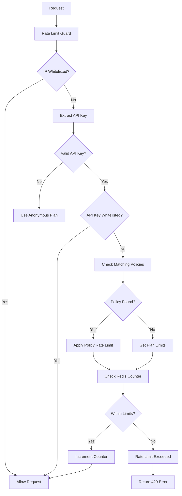

# Rate Limit Module

A comprehensive rate limiting solution for NestJS applications with dynamic policies, Redis-based distributed rate limiting, and admin management capabilities.

## 🚀 Features

- **Dynamic Rate Limiting**: Based on API keys, plans, and IP whitelisting
- **Multiple Strategies**: Fixed Window, Sliding Window, Token Bucket
- **Redis Integration**: Distributed rate limiting with cache invalidation
- **Admin Management**: Full CRUD operations for plans, API keys, and IP whitelists
- **Flexible Configuration**: Per-route overrides and policy-based rules
- **Type Safety**: Full TypeScript support with comprehensive interfaces
- **Scalable**: Multi-instance support with Redis Pub/Sub

## 📁 Structure

```
src/rate-limit/
├── entities/           # Database entities
│   ├── plan.entity.ts
│   ├── api-key.entity.ts
│   ├── ip-whitelist.entity.ts
│   └── rate-limit-policy.entity.ts
├── dto/               # Data Transfer Objects
│   ├── plan.dto.ts
│   ├── api-key.dto.ts
│   ├── ip-whitelist.dto.ts
│   └── rate-limit-policy.dto.ts
├── rate-limit.service.ts      # Core service
├── rate-limit.guard.ts        # Rate limiting guard
├── rate-limit.decorator.ts    # Decorators for configuration
├── rate-limit-admin.controller.ts  # Admin endpoints
├── rate-limit.module.ts       # Module configuration
└── README.md          # This file
```

## 🛠️ Installation

The module is already configured in your NestJS application. No additional installation required.

## ⚙️ Configuration

### Environment Variables

```env
# Redis Configuration
REDIS_URL=redis://localhost:6379
RATE_LIMIT_REDIS_URL=redis://localhost:6379/1

# Rate Limiting
RATE_LIMIT_TTL=60
RATE_LIMIT_LIMIT=100
RATE_LIMIT_CACHE_TTL=300
RATE_LIMIT_ENABLED=true
RATE_LIMIT_DEFAULT_PLAN=anonymous
```

### Module Registration

The module is automatically registered as global in `app.module.ts`:

```typescript
import { RateLimitModule } from './rate-limit/rate-limit.module';

@Module({
  imports: [
    // ... other modules
    RateLimitModule,
  ],
})
export class AppModule {}
```

## 🎯 Usage

### Basic Rate Limiting

The rate limiting is applied globally by default. All endpoints will be rate limited based on the user's plan.

```typescript
@Controller('api')
export class ApiController {
  @Get('data')
  getData() {
    return { data: 'some data' };
  }
}
```

### Bypass Rate Limiting

```typescript
import { BypassRateLimit } from './rate-limit/rate-limit.decorator';

@Controller('health')
export class HealthController {
  @Get()
  @BypassRateLimit()
  check() {
    return { status: 'ok' };
  }
}
```

### Custom Rate Limits

```typescript
import { CustomRateLimit, UsePlan } from './rate-limit/rate-limit.decorator';

@Controller('api')
export class ApiController {
  @Get('public')
  @UsePlan('free')
  getPublicData() {
    return { data: 'public' };
  }

  @Post('upload')
  @CustomRateLimit(10, 300) // 10 requests per 5 minutes
  uploadFile() {
    return { success: true };
  }
}
```

### Advanced Configuration

```typescript
import { RateLimit } from './rate-limit/rate-limit.decorator';

@Controller('api')
export class ApiController {
  @Post('messages')
  @RateLimit({ 
    policy: 'createMessage', 
    keyBy: ['userId', 'route'] 
  })
  createMessage() {
    return { success: true };
  }
}
```

## 📊 Rate Limit Plans

### Default Plans

The system comes with pre-configured plans:

- **anonymous**: 10 requests/minute (default for unauthenticated users)
- **free**: 100 requests/minute
- **pro**: 1000 requests/minute
- **enterprise**: 10000 requests/minute

### Plan Structure

```typescript
interface Plan {
  name: string;           // Plan identifier
  limitPerMin: number;    // Requests per minute
  ttlSec: number;         // Time window in seconds
  description?: string;   // Human-readable description
  active: boolean;        // Whether plan is active
  displayOrder: number;   // Sort order
}
```

## 🔑 API Keys

### Creating API Keys

```typescript
// Via admin endpoint
POST /api/v1/admin/rate-limit/api-keys
{
  "key": "ak_1234567890abcdef",
  "plan": "pro",
  "name": "Mobile App Key",
  "ownerId": "user_123",
  "isWhitelist": false,
  "expiresAt": "2024-12-31T23:59:59.000Z"
}
```

### Using API Keys

```bash
# Via X-API-Key header
curl -H "X-API-Key: ak_1234567890abcdef" http://localhost:3000/api/data

# Via Authorization header
curl -H "Authorization: Bearer ak_1234567890abcdef" http://localhost:3000/api/data
```

## 🌐 IP Whitelisting

### Adding IPs to Whitelist

```typescript
// Via admin endpoint
POST /api/v1/admin/rate-limit/ip-whitelist
{
  "ip": "192.168.1.100",
  "description": "Office network",
  "reason": "Internal service"
}
```

### Supported IP Formats

- Individual IPs: `192.168.1.100`
- CIDR ranges: `192.168.1.0/24`
- IPv6: `::1`

## 🔄 Rate Limiting Flow



## 🛡️ Rate Limiting Strategies

### Fixed Window
- Simple counter with time window
- Resets at window boundary
- Good for simple use cases

### Sliding Window
- Smooth rate limiting with overlapping windows
- More accurate than fixed window
- Better for burst handling

### Token Bucket
- Burst-friendly with token refill
- Allows short bursts up to bucket capacity
- Best for variable traffic patterns

## 📈 Admin Endpoints

### Plans Management

```bash
# Get all plans
GET /api/v1/admin/rate-limit/plans

# Create new plan
POST /api/v1/admin/rate-limit/plans
{
  "name": "premium",
  "limitPerMin": 5000,
  "ttlSec": 60,
  "description": "Premium plan for high-volume users"
}

# Update plan
PUT /api/v1/admin/rate-limit/plans/premium
{
  "limitPerMin": 10000,
  "description": "Updated premium plan"
}
```

### API Keys Management

```bash
# Get all API keys
GET /api/v1/admin/rate-limit/api-keys

# Create API key
POST /api/v1/admin/rate-limit/api-keys
{
  "key": "ak_newkey123",
  "plan": "pro",
  "name": "New API Key"
}

# Update API key
PUT /api/v1/admin/rate-limit/api-keys/{id}
{
  "plan": "enterprise",
  "active": true
}

# Delete API key
DELETE /api/v1/admin/rate-limit/api-keys/{id}
```

### IP Whitelist Management

```bash
# Get all whitelisted IPs
GET /api/v1/admin/rate-limit/ip-whitelist

# Add IP to whitelist
POST /api/v1/admin/rate-limit/ip-whitelist
{
  "ip": "10.0.0.0/8",
  "description": "Internal network"
}

# Update whitelist entry
PUT /api/v1/admin/rate-limit/ip-whitelist/{id}
{
  "description": "Updated internal network"
}

# Remove IP from whitelist
DELETE /api/v1/admin/rate-limit/ip-whitelist/{id}
```

### Policy Management

```bash
# Get all policies
GET /api/v1/admin/rate-limit/policies

# Create new policy
POST /api/v1/admin/rate-limit/policies
{
  "name": "api-upload-policy",
  "scope": "route",
  "routePattern": "^POST:/api/v1/upload$",
  "strategy": "tokenBucket",
  "burst": 10,
  "refillPerSec": 2,
  "priority": 200,
  "description": "Upload endpoint rate limiting"
}

# Update policy
PUT /api/v1/admin/rate-limit/policies/{id}
{
  "burst": 20,
  "refillPerSec": 5,
  "priority": 300
}

# Delete policy
DELETE /api/v1/admin/rate-limit/policies/{id}

# Get policy by name
GET /api/v1/admin/rate-limit/policies/name/{name}

# Test policy matching
POST /api/v1/admin/rate-limit/policies/{id}/test
{
  "userId": "user_123",
  "orgId": "org_456",
  "ip": "192.168.1.100",
  "routeKey": "POST:/api/v1/upload"
}
```

### Cache Management

```bash
# Get cache statistics
GET /api/v1/admin/rate-limit/cache/stats

# Invalidate cache across all instances
POST /api/v1/admin/rate-limit/cache/invalidate

# Reset rate limit for specific key
POST /api/v1/admin/rate-limit/reset/{key}

# Get rate limit info for key
GET /api/v1/admin/rate-limit/info/{key}
```

## 🔧 Configuration Options

### Rate Limit Override

```typescript
interface RateLimitOverride {
  plan?: string;        // Use specific plan
  limit?: number;       // Custom limit per minute
  ttl?: number;         // Custom TTL in seconds
  bypass?: boolean;     // Bypass rate limiting
  routeKey?: string;    // Custom route key
}
```

### Rate Limit Config

```typescript
interface RateLimitConfig {
  policy?: string;      // Specific policy name
  keyBy?: Array<'ip' | 'userId' | 'orgId' | 'route' | 'apiKey'>;
  bypass?: boolean;     // Bypass rate limiting
}
```

## 📊 Monitoring & Debugging

### Response Headers

Rate limit information is included in response headers:

```
X-RateLimit-Limit: 1000
X-RateLimit-Remaining: 999
X-RateLimit-Reset: 1640995200
X-RateLimit-Plan: pro
X-RateLimit-Status: allowed
```

### Logging

The module provides comprehensive logging:

```typescript
// Debug logs
RateLimitGuard: Rate limit check passed for 192.168.1.100 on GET:/api/data

// Warning logs
RateLimitGuard: Rate limit exceeded for 192.168.1.100 on GET:/api/data

// Error logs
RateLimitService: Error checking rate limit: Redis connection failed
```

## 🚨 Error Handling

### Rate Limit Exceeded

When rate limit is exceeded, the system returns:

```json
{
  "statusCode": 429,
  "message": "Rate limit exceeded. Try again in 60 seconds.",
  "error": "Too Many Requests"
}
```

### Fallback Behavior

On errors (Redis unavailable, database issues), the system:
- Logs the error
- Allows the request to proceed
- Sets appropriate headers

## 🔒 Security Considerations

1. **API Key Storage**: Store API keys securely (consider hashing)
2. **IP Whitelisting**: Use CIDR ranges for network whitelisting
3. **Rate Limit Bypass**: Use `@BypassRateLimit()` carefully
4. **Admin Endpoints**: Secure admin endpoints with proper authentication
5. **Redis Security**: Secure Redis instance with authentication

## 🧪 Testing

### Unit Tests

```typescript
describe('RateLimitService', () => {
  it('should allow request within limits', async () => {
    const result = await service.checkRateLimit({
      ip: '192.168.1.100',
      routeKey: 'GET:/api/data',
      apiKey: 'ak_test123'
    });
    
    expect(result.allowed).toBe(true);
  });
});
```

### Integration Tests

```typescript
describe('Rate Limit Integration', () => {
  it('should rate limit after exceeding threshold', async () => {
    // Make requests up to limit
    for (let i = 0; i < 10; i++) {
      await request(app.getHttpServer())
        .get('/api/data')
        .expect(200);
    }
    
    // Next request should be rate limited
    await request(app.getHttpServer())
      .get('/api/data')
      .expect(429);
  });
});
```

## 📝 Migration

### Database Migration

The module includes database migrations for all required tables:

```bash
# Run migrations
npm run migration:run

# Or with TypeORM CLI
npx typeorm migration:run
```

### Sample Data

Sample data is included for testing:

```bash
# Check sample data
GET /api/v1/admin/rate-limit/plans
GET /api/v1/admin/rate-limit/api-keys
```

## 🤝 Contributing

1. Follow the existing code style
2. Add tests for new features
3. Update documentation
4. Ensure all linter checks pass

## 📄 License

This module is part of the main application and follows the same license terms.

## 🆘 Support

For issues and questions:
1. Check the logs for error details
2. Verify Redis connectivity
3. Check database migrations
4. Review configuration settings

---

**Note**: This module is designed to be production-ready with proper error handling, logging, and monitoring capabilities. Always test thoroughly in your environment before deploying to production.
