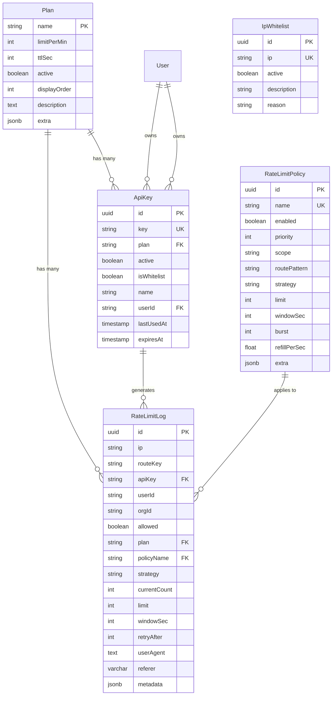
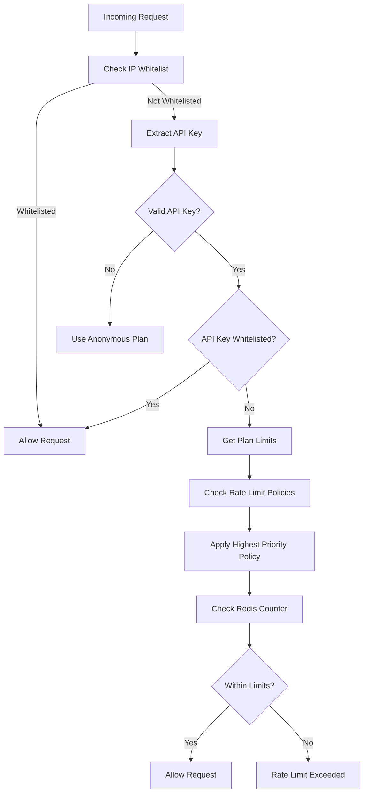

# Rate Limit Entities

This document explains the database entities used in the rate limiting system, their relationships, and how they work together to provide comprehensive rate limiting functionality.

## 📊 Entity Overview

The rate limiting system consists of 5 main entities that work together to provide flexible and scalable rate limiting:

1. **Plan** - Defines rate limit tiers and configurations
2. **ApiKey** - Associates API keys with specific plans
3. **IpWhitelist** - Manages IP addresses that bypass rate limits
4. **RateLimitPolicy** - Advanced policy-based rate limiting rules
5. **RateLimitLog** - Tracks rate limit events for monitoring and analytics

## 🏗️ Entity Relationships



## 📋 Entity Details

### 1. Plan Entity

**Purpose**: Defines different rate limiting tiers and their configurations.

**Key Fields**:
- `name`: Unique plan identifier (e.g., 'anonymous', 'free', 'pro', 'enterprise')
- `limitPerMin`: Maximum requests allowed per minute
- `ttlSec`: Time window for rate limit counters (default: 60 seconds)
- `active`: Whether the plan is available for assignment
- `displayOrder`: Sort order for admin interface

**Usage**:
```typescript
// Create a new plan
const plan = new Plan();
plan.name = 'premium';
plan.limitPerMin = 5000;
plan.ttlSec = 60;
plan.description = 'Premium plan for high-volume users';
plan.active = true;
plan.displayOrder = 3;
```

**Default Plans**:
- **anonymous**: 10 requests/minute (unauthenticated users)
- **free**: 100 requests/minute
- **pro**: 1000 requests/minute
- **enterprise**: 10000 requests/minute

### 2. ApiKey Entity

**Purpose**: Associates API keys with specific rate limit plans and manages key lifecycle.

**Key Fields**:
- `key`: The actual API key string (should be hashed in production)
- `plan`: Foreign key reference to Plan.name
- `active`: Whether the key is currently active
- `isWhitelist`: Whether the key bypasses all rate limits
- `userId`: Optional owner reference
- `lastUsedAt`: Last usage timestamp for monitoring
- `expiresAt`: Optional expiration date

**Usage**:
```typescript
// Create a new API key
const apiKey = new ApiKey();
apiKey.key = 'ak_1234567890abcdef';
apiKey.plan = 'pro';
apiKey.name = 'Mobile App Key';
apiKey.userId = 'user_123';
apiKey.isWhitelist = false;
apiKey.expiresAt = new Date('2024-12-31');
```

**Key Methods**:
- `isExpired()`: Check if key has expired
- `isValid()`: Check if key is active and not expired

### 3. IpWhitelist Entity

**Purpose**: Manages IP addresses that bypass all rate limits.

**Key Fields**:
- `ip`: IP address or CIDR range (e.g., '192.168.1.100', '10.0.0.0/8')
- `active`: Whether the whitelist entry is active
- `description`: Human-readable description
- `reason`: Reason for whitelisting (e.g., 'internal-service', 'monitoring')

**Usage**:
```typescript
// Add IP to whitelist
const whitelist = new IpWhitelist();
whitelist.ip = '192.168.1.0/24';
whitelist.description = 'Office network';
whitelist.reason = 'Internal service';
whitelist.active = true;
```

**Supported IP Formats**:
- Individual IPs: `192.168.1.100`
- CIDR ranges: `192.168.1.0/24`, `10.0.0.0/8`
- IPv6: `::1`, `2001:db8::/32`

### 4. RateLimitPolicy Entity

**Purpose**: Advanced policy-based rate limiting with multiple strategies and scopes.

**Key Fields**:
- `name`: Unique policy identifier
- `enabled`: Whether the policy is active
- `priority`: Priority level (higher = more important)
- `scope`: Policy scope (global, route, user, org, ip)
- `strategy`: Rate limiting strategy (fixedWindow, slidingWindow, tokenBucket)
- `limit`: Rate limit for window-based strategies
- `windowSec`: Time window for window-based strategies
- `burst`: Burst capacity for token bucket
- `refillPerSec`: Token refill rate for token bucket

**Usage**:
```typescript
// Create a policy for specific route
const policy = new RateLimitPolicy();
policy.name = 'api-create-message';
policy.scope = 'route';
policy.routePattern = '^POST:/api/v1/messages$';
policy.strategy = 'tokenBucket';
policy.burst = 20;
policy.refillPerSec = 5;
policy.priority = 200;
policy.enabled = true;
```

### 5. RateLimitLog Entity

**Purpose**: Tracks rate limit events for monitoring, analytics, and debugging.

**Key Fields**:
- `ip`: IP address of the request
- `routeKey`: Route key (method:path)
- `apiKey`: API key used (if any)
- `userId`: User ID (if authenticated)
- `orgId`: Organization ID (if applicable)
- `allowed`: Whether the request was allowed
- `plan`: Rate limit plan used
- `policyName`: Policy name used (if any)
- `strategy`: Rate limit strategy used
- `currentCount`: Current count when request was made
- `limit`: Rate limit applied
- `windowSec`: Time window in seconds
- `retryAfter`: Retry after time in seconds (if rate limited)

**Usage**:
```typescript
// Create a rate limit log entry
const log = new RateLimitLog();
log.ip = '192.168.1.100';
log.routeKey = 'POST:/api/v1/messages';
log.apiKey = 'ak_1234567890abcdef';
log.userId = 'user_123';
log.allowed = true;
log.plan = 'pro';
log.policyName = 'api-create-message';
log.strategy = 'tokenBucket';
log.currentCount = 5;
log.limit = 100;
log.windowSec = 60;
log.userAgent = 'Mozilla/5.0...';
log.referer = 'https://example.com';
```

**Key Relations**:
- **Plan**: Many-to-one relationship with Plan entity
- **RateLimitPolicy**: Many-to-one relationship with RateLimitPolicy entity
- **ApiKey**: Indirect relationship through apiKey field

## 📊 Các Relation đã được thiết lập

### 1. Plan ↔ ApiKey: One-to-Many
- **Plan** có nhiều **ApiKey**
- **ApiKey** thuộc về một **Plan**
- Foreign key: `ApiKey.plan` → `Plan.name`

### 2. Plan ↔ RateLimitLog: One-to-Many
- **Plan** có nhiều **RateLimitLog**
- **RateLimitLog** thuộc về một **Plan**
- Foreign key: `RateLimitLog.plan` → `Plan.name`

### 3. ApiKey ↔ RateLimitLog: One-to-Many (indirect)
- **ApiKey** tạo ra nhiều **RateLimitLog**
- **RateLimitLog** liên kết với **ApiKey** qua `apiKey` field
- Không có foreign key constraint trực tiếp

### 4. RateLimitPolicy ↔ RateLimitLog: One-to-Many
- **RateLimitPolicy** áp dụng cho nhiều **RateLimitLog**
- **RateLimitLog** thuộc về một **RateLimitPolicy**
- Foreign key: `RateLimitLog.policyName` → `RateLimitPolicy.name`

### 5. User ↔ ApiKey: One-to-Many
- **User** sở hữu nhiều **ApiKey**
- **ApiKey** thuộc về một **User**
- Foreign key: `ApiKey.userId` → `User.id`

## 🔄 Rate Limiting Flow & Priority

### 1. Request Processing Order



### 2. Priority Order

1. **IP Whitelist** (Highest Priority)
   - If IP is whitelisted → Allow immediately
   - Bypasses all other checks

2. **API Key Whitelist**
   - If API key has `isWhitelist = true` → Allow immediately
   - Bypasses rate limiting

3. **Rate Limit Policies**
   - Policies are evaluated by priority (higher number = higher priority)
   - Only the highest priority matching policy is applied
   - If no policies match, fall back to plan-based limiting

4. **Plan-based Rate Limiting**
   - Uses the plan associated with the API key
   - If no API key, uses 'anonymous' plan
   - Applies plan's `limitPerMin` and `ttlSec`

### 3. Policy Matching Logic

```typescript
// Policy matching example
const context = {
  userId: 'user_123',
  orgId: 'org_456',
  ip: '192.168.1.100',
  routeKey: 'POST:/api/v1/messages'
};

// Policies are evaluated in priority order
const policies = [
  { name: 'global-policy', priority: 100, scope: 'global' },
  { name: 'route-policy', priority: 200, scope: 'route', routePattern: '^POST:/api/v1/messages$' },
  { name: 'user-policy', priority: 300, scope: 'user', extra: { userIds: ['user_123'] } }
];

// Result: 'user-policy' is selected (highest priority that matches)
```

## 🎯 Rate Limiting Strategies

### 1. Fixed Window
- **Description**: Simple counter with time window
- **Behavior**: Resets at window boundary
- **Use Case**: Simple rate limiting scenarios
- **Fields**: `limit`, `windowSec`

### 2. Sliding Window
- **Description**: Smooth rate limiting with overlapping windows
- **Behavior**: More accurate than fixed window
- **Use Case**: Better burst handling
- **Fields**: `limit`, `windowSec`

### 3. Token Bucket
- **Description**: Burst-friendly with token refill
- **Behavior**: Allows short bursts up to bucket capacity
- **Use Case**: Variable traffic patterns
- **Fields**: `burst`, `refillPerSec`

## 🔧 Configuration Examples

### Basic Plan Configuration
```typescript
// Anonymous users
const anonymousPlan = {
  name: 'anonymous',
  limitPerMin: 10,
  ttlSec: 60,
  active: true,
  displayOrder: 1
};

// Pro users
const proPlan = {
  name: 'pro',
  limitPerMin: 1000,
  ttlSec: 60,
  active: true,
  displayOrder: 3
};
```

### API Key Configuration
```typescript
// Standard API key
const apiKey = {
  key: 'ak_pro_1234567890abcdef',
  plan: 'pro',
  name: 'Mobile App',
  userId: 'user_123',
  isWhitelist: false,
  expiresAt: new Date('2024-12-31')
};

// Whitelisted API key
const whitelistKey = {
  key: 'ak_admin_abcdef1234567890',
  plan: 'enterprise',
  name: 'Admin Key',
  isWhitelist: true // Bypasses all rate limits
};
```

### IP Whitelist Configuration
```typescript
// Individual IP
const singleIp = {
  ip: '192.168.1.100',
  description: 'Admin workstation',
  reason: 'admin'
};

// Network range
const networkRange = {
  ip: '10.0.0.0/8',
  description: 'Internal network',
  reason: 'internal-service'
};
```

### Policy Configuration
```typescript
// Global policy
const globalPolicy = {
  name: 'global-rate-limit',
  scope: 'global',
  strategy: 'fixedWindow',
  limit: 1000,
  windowSec: 60,
  priority: 100
};

// Route-specific policy
const routePolicy = {
  name: 'upload-policy',
  scope: 'route',
  routePattern: '^POST:/api/v1/upload$',
  strategy: 'tokenBucket',
  burst: 5,
  refillPerSec: 1,
  priority: 200
};

// User-specific policy
const userPolicy = {
  name: 'vip-user-policy',
  scope: 'user',
  extra: { userIds: ['user_vip_123'] },
  strategy: 'tokenBucket',
  burst: 100,
  refillPerSec: 10,
  priority: 300
};
```

## 🚨 Error Handling

### Entity Validation
```typescript
// Plan validation
if (!plan.name || plan.limitPerMin <= 0) {
  throw new Error('Invalid plan configuration');
}

// API key validation
if (!apiKey.key || !apiKey.plan) {
  throw new Error('API key must have key and plan');
}

// IP whitelist validation
if (!this.isValidIp(whitelist.ip)) {
  throw new Error('Invalid IP address format');
}
```

### Rate Limit Exceeded
```typescript
// When rate limit is exceeded
if (currentCount >= limit) {
  return {
    allowed: false,
    headers: {
      'X-RateLimit-Limit': limit.toString(),
      'X-RateLimit-Remaining': '0',
      'X-RateLimit-Reset': resetTime.toString(),
      'Retry-After': windowSec.toString()
    },
    retryAfter: windowSec
  };
}
```

## 📊 Monitoring & Analytics

### Key Metrics to Track
- **Plan Usage**: Which plans are most used
- **API Key Activity**: Most active API keys
- **Rate Limit Hits**: How often limits are exceeded
- **Policy Effectiveness**: Which policies are most effective
- **IP Whitelist Usage**: Which IPs are whitelisted

### Database Queries
```sql
-- Most used plans
SELECT plan, COUNT(*) as usage_count 
FROM api_keys 
WHERE active = true 
GROUP BY plan 
ORDER BY usage_count DESC;

-- Rate limit violations
SELECT route_key, COUNT(*) as violation_count 
FROM rate_limit_logs 
WHERE allowed = false 
GROUP BY route_key 
ORDER BY violation_count DESC;

-- Active API keys
SELECT COUNT(*) as active_keys 
FROM api_keys 
WHERE active = true AND (expires_at IS NULL OR expires_at > NOW());
```

## 🔒 Security Considerations

### API Key Security
- **Hashing**: Store API keys as hashes, not plain text
- **Rotation**: Implement key rotation policies
- **Expiration**: Set reasonable expiration dates
- **Monitoring**: Track key usage and anomalies

### IP Whitelist Security
- **Validation**: Validate IP address formats
- **CIDR**: Use CIDR ranges for network whitelisting
- **Audit**: Regular audit of whitelisted IPs
- **Removal**: Remove unused whitelist entries

### Policy Security
- **Validation**: Validate policy configurations
- **Testing**: Test policies before deployment
- **Monitoring**: Monitor policy effectiveness
- **Updates**: Regular policy updates and reviews

## 🧪 Testing

### Unit Tests
```typescript
describe('Plan Entity', () => {
  it('should create a valid plan', () => {
    const plan = new Plan();
    plan.name = 'test';
    plan.limitPerMin = 100;
    plan.ttlSec = 60;
    
    expect(plan.name).toBe('test');
    expect(plan.limitPerMin).toBe(100);
    expect(plan.ttlSec).toBe(60);
  });
});
```

### Integration Tests
```typescript
describe('Rate Limiting Flow', () => {
  it('should apply plan-based rate limiting', async () => {
    const plan = await planRepo.save({
      name: 'test-plan',
      limitPerMin: 10,
      ttlSec: 60
    });
    
    const apiKey = await apiKeyRepo.save({
      key: 'ak_test',
      plan: plan.name,
      active: true
    });
    
    // Test rate limiting logic
    const result = await rateLimitService.checkRateLimit({
      ip: '192.168.1.100',
      routeKey: 'GET:/api/test',
      apiKey: apiKey.key
    });
    
    expect(result.allowed).toBe(true);
  });
});
```

## 📝 Best Practices

### 1. Plan Design
- Start with conservative limits
- Gradually increase based on usage patterns
- Use descriptive names and descriptions
- Set appropriate display orders

### 2. API Key Management
- Use secure key generation
- Implement key rotation
- Monitor key usage
- Set reasonable expiration dates

### 3. IP Whitelisting
- Use specific IPs when possible
- Document whitelist reasons
- Regular cleanup of unused entries
- Monitor whitelist usage

### 4. Policy Configuration
- Start with simple policies
- Test policies thoroughly
- Use appropriate priorities
- Monitor policy effectiveness

### 5. Monitoring
- Track key metrics
- Set up alerts
- Regular reviews
- Performance optimization

---

This entity system provides a flexible and scalable foundation for rate limiting that can adapt to various use cases and requirements. The modular design allows for easy extension and customization while maintaining performance and reliability.
